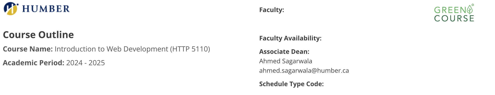

# HTTP 5110

## Learning Outcomes
- Keep track of your work hours with a timesheet.
- Make a simple website with HTML and CSS.
- Use the Linux command line.
- Practice using email according to a set of rules.
- Create a Minimum Viable Product (MVP) description from a known source.

This is a link to the class : [http5110](https://humber.ca/transferoptions/course-outlines/outline.html?code=HTTP%205110&view=1&year=2024)

## Code Sample

### The CLI
Using the Command Line Interface (CLI) is a skill you will need to acquire.
Professional Web developers use the CLI on a regular basis: it is easy to use,
efficient, and allows you to do many things at once. It is also a status thing:
not using a GUI has more status that using one. All the images you see of
hackers interacting with keyboard and a screen are using the CLI.

>[!Note]
> Professor Bernard Monette makes learning enjoyable with their fun approach and is incredibly patient, ensuring every student feels supported!
